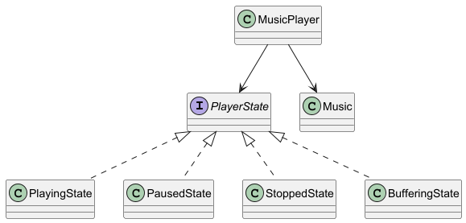
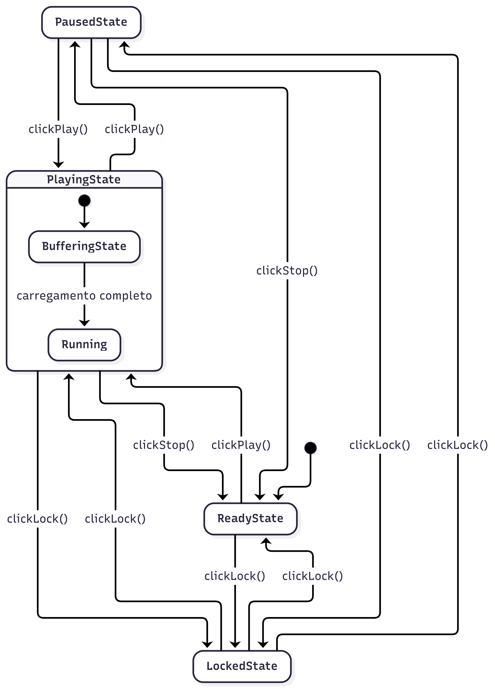

# 🎵 Music Player - Padrão de Projeto State

## 📌 Descrição do Projeto

Este projeto implementa um **Music Player simplificado** utilizando o padrão de projeto **State**.

O objetivo é demonstrar como o comportamento de um sistema pode variar de acordo com o seu estado interno, permitindo transições dinâmicas entre estados como:

- Tocando música (Playing)
- Música pausada (Paused)
- Player parado (Stopped)
- Carregando música (Buffering)

Cada estado possui regras próprias de comportamento, garantindo uma separação clara de responsabilidades e facilitando a manutenção do sistema.

---

## 🧩 Diagrama de Classes

### 📌 Legenda
- `MusicPlayer`: Classe principal responsável pelo controle do player
- `Music`: Representa uma música da playlist
- `PlayerState`: Interface base do padrão State
- `PlayingState`, `PausedState`, `StoppedState`, `BufferingState`: Estados concretos do player

---

## 🔄 Diagrama de Estados

### 📌 Legenda
- **Stopped**: Player parado
- **Playing**: Música em reprodução
- **Paused**: Reprodução pausada
- **Buffering**: Carregando música
- **[*]**: Estado inicial/final do sistema

O diagrama abaixo representa as transições entre os estados do Music Player e suas regras de mudança.

